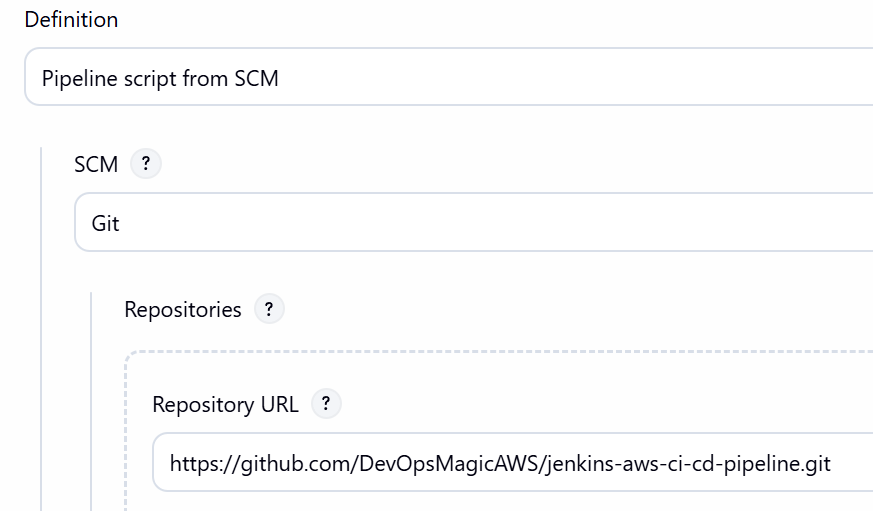
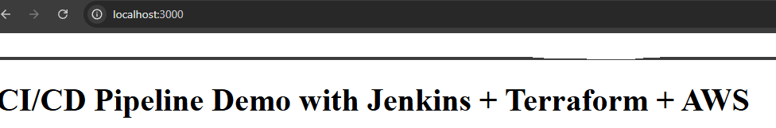
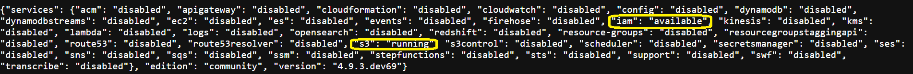
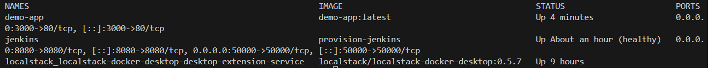
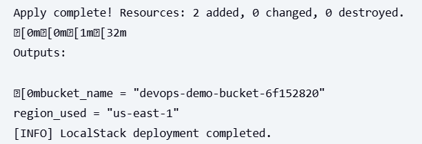

# Jenkins AWS CI/CD Pipeline with LocalStack

A complete DevOps CI/CD pipeline using Jenkins, Terraform, Docker, and LocalStack for AWS service mocking.



## 🚀 Live Demo










## Architecture


- **Jenkins**: CI/CD orchestration
- **Terraform**: Infrastructure as Code
- **LocalStack**: AWS services mocking
- **Docker**: Application containerization
- **S3**: Remote state storage

## Quick Start

1. **Start Services**:
   ```bash
   cd provision
   docker compose up -d
   ```

2. **Access Jenkins**: http://localhost:8080 (admin/admin123)
3. **Access LocalStack**: http://localhost:4566 (from host machine)
4. **Create Jenkins Pipeline**: New Item → Pipeline → Use SCM → Point to this repository

**Note**: Jenkins comes pre-configured with required plugins and credentials. Jenkins and LocalStack communicate internally via `localstack:4566` on the Docker network.

## Pipeline Stages

1. **Checkout**: Get source code from SCM
2. **Start LocalStack**: Initialize AWS mock services (S3, IAM)
3. **Validate Terraform**: Initialize, validate, and plan infrastructure
4. **Build Docker Image**: Create nginx container with demo app
5. **Deploy**: Apply Terraform configuration to LocalStack
6. **Destroy (Optional)**: Clean up infrastructure if parameter enabled

## Project Structure

```
├── app/                 # Application code
├── infra-tf/           # Terraform infrastructure
├── provision/          # Docker compose setup
├── scripts/            # Deployment scripts
└── jenkinsfile         # Pipeline definition
```

## Features

- ✅ Remote Terraform state in S3 (LocalStack)
- ✅ LocalStack AWS mocking (S3, IAM)
- ✅ Docker containerization
- ✅ Automated CI/CD pipeline
- ✅ Infrastructure validation
- ✅ Optional infrastructure destruction
- ✅ Docker network communication
- ✅ Pipeline parameters
- ✅ Health checks and restart policies
- ✅ Pre-configured Jenkins with essential plugins
- ✅ Visual pipeline stage view
- ✅ Docker CLI integrated in Jenkins container
- ✅ Terraform CLI integrated in Jenkins container
- ✅ One-command setup

## Pipeline Parameters

- **DESTROY_INFRASTRUCTURE**: Boolean parameter to optionally destroy resources after deployment (default: false)

## Network Architecture

- Jenkins and LocalStack communicate via Docker network (`devops-net`)
- Jenkins uses container name `localstack:4566` for API calls
- No localhost dependencies within containers